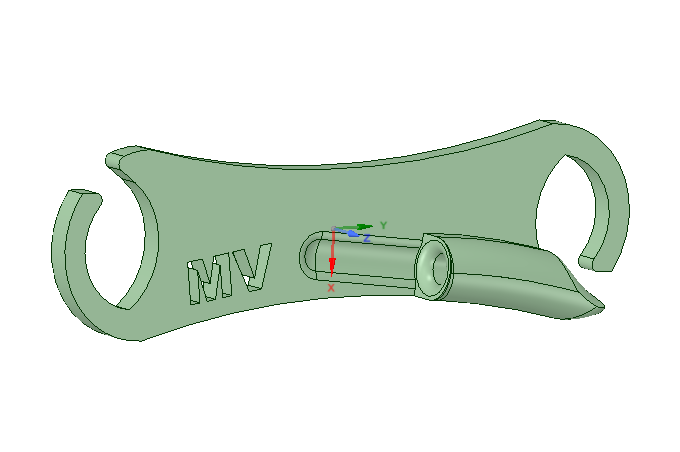
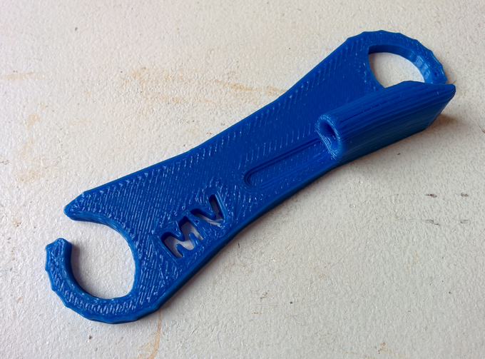
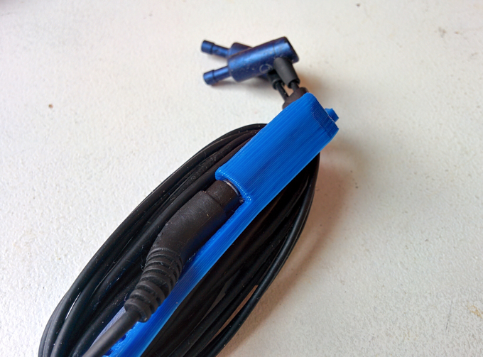

# Earbud Untangler

Needed to do a little practice with the 3D modeling software,
so I modeled this little clip to wrap my earbud cord around.

It has a slot to plug the headphone jack into, as a way of 
securing one end of the cable.

## Digital Model

## Physical Print

